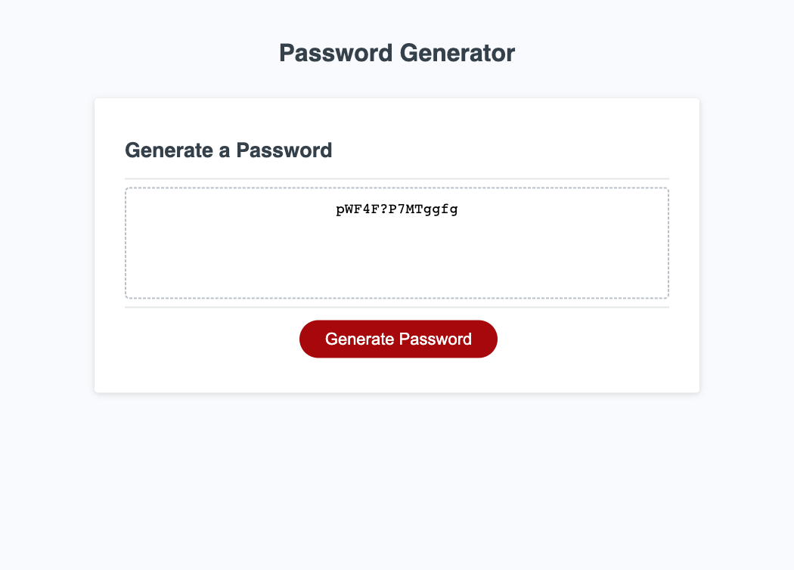

# Random Password Generator

[Click here to view final version of webpage](https://kcschaefs.github.io/password-generator/)




## User Story

```
AS AN employee with access to sensitive data
I WANT to randomly generate a password that meets certain criteria
SO THAT I can create a strong password that provides greater security
```

## Tasks
- generate arrays for special characters, uppercase, lowercase, and numbers
- generate ask functions to allow for user selection of character number and character types
- generate functions that concatenate the corresponding array into a "selection" array for the password generator to pull from
- create a function that will randomly select a character from the chosen selection array
- display generated password
- add alert when user does not select number of characters within parameters (8-128)
- add alert when user doesn't select any characters

## Learnings
- I need to focus more on the smallest possible steps to write the code, I get too focused on the larger functionality rather than the next logical step
- how to use alerts
- how to change the text displayed on the webpage based on the JavaScript code + user inputs
- became much more familiar and comfortable with JavaScript, expecially functions, variables, and prompts/alerts
- Google is my friend

## Future Improvements
- cleaning up the code to be more efficient + follow best practice
- add a copy button so the user can eadily copy their password
- utilize check boxes or radio buttons for user to select the components of the password rather than prompts
